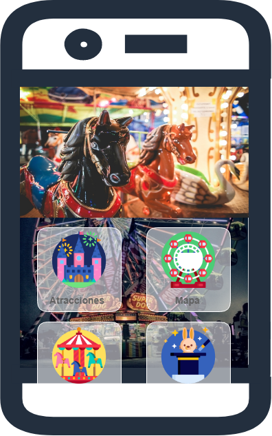

# Integrantes
Jorge Niño Cabal
José Pablo Prado Ayala
# Actividad 1
Ejercicio de actividad que engloba todo lo visto en Android hasta el momento

## Instrucciones
Generar una app de Android con 1 vista que tenga un menú como el que se muestra a continuación

* El formato de desarrollo es libre, se podrán usar cualquiera de los conceptos que hayamos visto en clase
* Se podrá hacer uso de archivos adicionales de recursos como formas o componentes anidados como scrolls views
* La app deberá estar optimizada para correr desde la versión 5 de Android Lollipop
* La app se deberá realizar en parejas
* Al probar la aplicación está deberá ser rápida, esto quiere decir que se deberán optimizar los recursos para la misma, cualquier aplicación con lag tendrá una penalización sobre la calificación
* Solamente se podrán utilizar los assets de imágenes entregados en este repositorio como son las imagenes de fondo y los iconos para cualquiera de las opciones del menú. 
* Se darán 1 punto adicional para toda aquella app que logre mejorar el diseño presentado a hacer más legible, más usable, más dinámica, sin modificar el diseño original utilizando cualquiera de los componentes o diseños nativos de Android.

## Opciones que deberá contener el mapa (No Importa el Orden)

1. Extremos
2. Mapa
3. Perfil
4. Información
5. Redes Sociales
6. Transporte
7. Comida
8. Atracciones
9. Reservaciones
10. Favoritos
11. Niños

## Formato de entrega y condiciones de evaluación
* Se debera entregar el código fuente con el archivo .apk generado en la raíz del proyecto
1 solo entregable por equipo
* Toda app que no pueda ser instalada será tomada como no entregada
* Toda entrega que no cuente con el código fuente o con el archivo .apk será tomada como no entregada

## Rúbrica de Evaluación
Criterios           |      1                                                          |      0
-------------       | -------------                                                   | -------------
Menú                | El menú contiene las 11 opciones                                | El menú no contiene las 11 opciones
Assets              | Los assets están optimizados                                    | Los assets no están optimizados
Retrocompatibilidad | La app corre desde Android 5                                    | La app no corre desde Android 5
Velocidad           | La app es rápida en Android 5 para un dispositivo de gama baja  | La app es lenta en Android 5 para un dispositivo de gama baja
